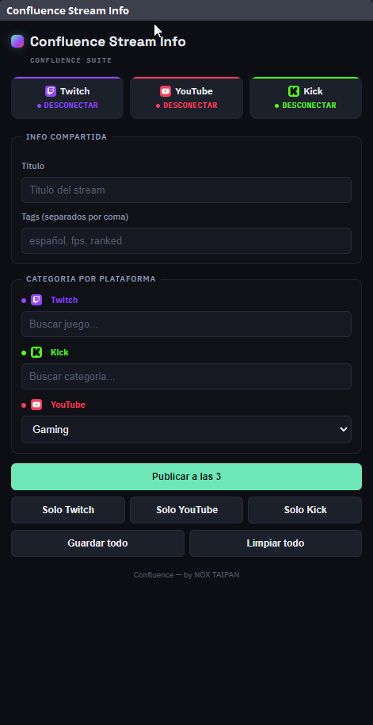

[🇬🇧 English](CONFLUENCE-INSTALL.en.md) | 🇪🇸 **Español**

# Reinstalar "Confluence Multistream" (despues de reinstalar OBS)

Este es el fork de obs-multi-rtmp (con soporte de websocket) compilado para NOX TAIPAN, ya con el tema oscuro/verde y la fuente IBM Plex Sans de Confluence.



Ademas de arrancar/detener destinos RTMP, este dock muestra el estado del servidor de Confluence (punto verde/gris) y tiene botones **Restart** y **Repair** para reiniciarlo sin salir de OBS — ver `../confluence/README.md`, seccion "Arranque".

Si reinstalas OBS o cambias de PC, **no hace falta recompilar** — el build ya está listo en `build_x64/rundir/Release/`. Solo corre:

```powershell
powershell -ExecutionPolicy Bypass -File install.ps1
```

(o clic derecho sobre `install.ps1` → "Ejecutar con PowerShell")

Esto:
1. Pide permisos de administrador (una vez).
2. Copia `obs-multi-rtmp.dll` a `obs-plugins\64bit\` y la carpeta de datos (locale + fuente) a `data\obs-plugins\obs-multi-rtmp\` de tu instalacion de OBS.

Requisito: OBS tiene que estar **cerrado** mientras corre el instalador.

Después, dos pasos manuales de un solo uso (no los puede hacer el script, se hacen desde la UI de OBS):
- **Docks → Custom Browser Docks** → agrega `Confluence Stream Info` con URL `http://localhost:7773`, y `Confluence Chat` con URL `http://localhost:7773/currents.html`.
- Arrancar Confluence una primera vez con el boton **Restart** de este mismo dock (ver arriba) — no hace falta ningun script de OBS para esto, `scripts/obs-autostart.lua` quedo en desuso.

## Si necesitas recompilar desde cero

Si el `.dll` ya no existe (por ejemplo, borraste `build_x64/`), hace falta el toolchain completo: Visual Studio con el workload "Desktop development with C++" y CMake. Segui la seccion **"Build commands"** del `README.md` original de este fork, pero llama a la carpeta de build `build_x64` (no `build`) para que coincida con lo que espera `install.ps1`:

```powershell
mkdir build_x64
cd build_x64
cmake .. -G "Visual Studio 17 2022" -A x64 -DENABLE_QT=ON -DENABLE_FRONTEND_API=ON -DENABLE_WEBSOCKET=ON
cmake --build . --config Release
```

Esto deja el `.dll` en `build_x64/rundir/Release/` (o `build_x64/Release/`, segun la version de CMake) para que `install.ps1` lo copie a OBS.

## Suite completa

Este plugin es una pieza de **Confluence Suite** — cada una se instala por separado, usa lo que necesites:

| Repo | Que es |
|---|---|
| [confluence-beta](https://github.com/NoxTaipan/confluence-beta) | El panel web (OBS dock): titulo/tags/categoria + chat unificado de Twitch/YouTube/Kick. |
| **confluence-multistream** (este repo) | Plugin nativo de OBS para mandar el video a varios destinos RTMP a la vez. |
| [confluence-streamdeck-beta](https://github.com/NoxTaipan/confluence-streamdeck-beta) | Plugin de Elgato Stream Deck para controlar todo lo anterior desde botones fisicos. Opcional. |
